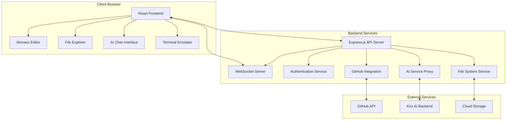

# Design Document

## Overview

The web-based Kiro will be a modern, lightweight single-page application (SPA) that brings Kiro's AI-powered IDE capabilities to the browser. The architecture will use a React-based frontend with a Node.js backend, leveraging WebSockets for real-time communication and modern web technologies for optimal performance.

## Architecture

### High-Level Architecture



### Technology Stack

**Frontend:**

- React 18 with TypeScript for component-based UI
- Monaco Editor (VS Code's editor) for code editing with syntax highlighting
- Tailwind CSS for modern, lightweight styling
- Zustand for lightweight state management
- React Query for server state management and caching
- Socket.io-client for real-time communication

**Backend:**

- Node.js with Express.js for REST API
- Socket.io for WebSocket connections
- Passport.js for authentication (GitHub OAuth)
- Multer for file upload handling
- Node.js file system APIs for file operations
- GitHub REST API for repository integration

**Infrastructure:**

- Docker containers for deployment
- Redis for session storage and caching
- Cloud storage (AWS S3 or similar) for file persistence
- CDN for static asset delivery

## Components and Interfaces

### Frontend Components

#### 1. Main Layout Component

```typescript
interface MainLayoutProps {
  user: User | null;
  currentProject: Project | null;
}

const MainLayout: React.FC<MainLayoutProps> = ({ user, currentProject }) => {
  // Renders header, sidebar, main editor area, and chat panel
};
```

#### 2. Code Editor Component

```typescript
interface CodeEditorProps {
  file: FileContent;
  onSave: (content: string) => void;
  onContentChange: (content: string) => void;
  language: string;
}

const CodeEditor: React.FC<CodeEditorProps> = ({
  file,
  onSave,
  onContentChange,
  language,
}) => {
  // Monaco Editor integration with Kiro-specific features
};
```

#### 3. File Explorer Component

```typescript
interface FileExplorerProps {
  projectFiles: FileTree;
  onFileSelect: (file: File) => void;
  onFileCreate: (path: string, type: "file" | "folder") => void;
  onFileDelete: (path: string) => void;
}
```

#### 4. AI Chat Component

```typescript
interface AIChatProps {
  messages: ChatMessage[];
  onSendMessage: (message: string) => void;
  currentContext: ProjectContext;
}
```

#### 5. GitHub Integration Component

```typescript
interface GitHubPushProps {
  project: Project;
  onPushComplete: (repoUrl: string) => void;
  isAuthenticated: boolean;
}
```

### Backend API Endpoints

#### Authentication

- `POST /auth/github` - GitHub OAuth authentication
- `GET /auth/user` - Get current user info
- `POST /auth/logout` - Logout user

#### Project Management

- `GET /api/projects` - List user projects
- `POST /api/projects` - Create new project
- `DELETE /api/projects/:id` - Delete project
- `GET /api/projects/:id/files` - Get project file tree

#### File Operations

- `GET /api/files/:path` - Get file content
- `PUT /api/files/:path` - Save file content
- `POST /api/files` - Create new file/folder
- `DELETE /api/files/:path` - Delete file/folder
- `POST /api/upload` - Upload files

#### AI Integration

- `POST /api/ai/chat` - Send message to Kiro AI
- `GET /api/ai/context` - Get current project context for AI

#### GitHub Integration

- `POST /api/github/push` - Push project to GitHub
- `GET /api/github/repos` - List user's GitHub repositories
- `POST /api/github/create-repo` - Create new GitHub repository

### WebSocket Events

#### Client to Server

- `join-project` - Join a project room for real-time updates
- `file-change` - Broadcast file changes to collaborators
- `cursor-position` - Share cursor position for collaborative editing

#### Server to Client

- `file-updated` - Notify of file changes from other users
- `user-joined` - Notify when collaborator joins project
- `ai-response` - Stream AI responses in real-time

## Data Models

### User Model

```typescript
interface User {
  id: string;
  githubId: string;
  username: string;
  email: string;
  avatarUrl: string;
  createdAt: Date;
  lastLoginAt: Date;
}
```

### Project Model

```typescript
interface Project {
  id: string;
  name: string;
  description?: string;
  ownerId: string;
  collaborators: string[];
  fileTree: FileTree;
  githubRepo?: {
    owner: string;
    name: string;
    url: string;
  };
  createdAt: Date;
  updatedAt: Date;
}
```

### File Model

```typescript
interface FileContent {
  path: string;
  content: string;
  language: string;
  size: number;
  lastModified: Date;
  checksum: string;
}

interface FileTree {
  [path: string]: {
    type: "file" | "folder";
    children?: FileTree;
    metadata?: {
      size: number;
      lastModified: Date;
    };
  };
}
```

### Chat Message Model

```typescript
interface ChatMessage {
  id: string;
  type: "user" | "ai";
  content: string;
  timestamp: Date;
  context?: {
    files: string[];
    selectedText?: string;
  };
}
```

## Error Handling

### Frontend Error Handling

- Global error boundary for React component errors
- Toast notifications for user-facing errors
- Retry mechanisms for network failures
- Offline detection and graceful degradation

### Backend Error Handling

- Centralized error middleware for Express.js
- Structured error responses with error codes
- Rate limiting to prevent abuse
- Input validation and sanitization

### Error Types

```typescript
enum ErrorCode {
  AUTHENTICATION_FAILED = "AUTH_001",
  FILE_NOT_FOUND = "FILE_001",
  PERMISSION_DENIED = "PERM_001",
  GITHUB_API_ERROR = "GITHUB_001",
  AI_SERVICE_UNAVAILABLE = "AI_001",
  STORAGE_QUOTA_EXCEEDED = "STORAGE_001",
}
```

## Testing Strategy

### Frontend Testing

- **Unit Tests**: Jest + React Testing Library for component testing
- **Integration Tests**: Testing user workflows and API integration
- **E2E Tests**: Playwright for full user journey testing
- **Visual Regression Tests**: Chromatic for UI consistency

### Backend Testing

- **Unit Tests**: Jest for individual function testing
- **API Tests**: Supertest for endpoint testing
- **Integration Tests**: Testing database and external service integration
- **Load Tests**: Artillery.js for performance testing

### Test Coverage Goals

- Minimum 80% code coverage for critical paths
- 100% coverage for authentication and file operations
- Performance benchmarks for editor responsiveness (<100ms)
- Cross-browser compatibility testing (Chrome, Firefox, Safari, Edge)

### Continuous Integration

- GitHub Actions for automated testing
- Automated deployment to staging environment
- Performance monitoring and alerting
- Security scanning for dependencies

## Performance Optimizations

### Frontend Optimizations

- Code splitting and lazy loading for reduced initial bundle size
- Virtual scrolling for large file trees
- Debounced auto-save to reduce server requests
- Service worker for offline caching
- WebAssembly for computationally intensive operations

### Backend Optimizations

- Redis caching for frequently accessed files
- Connection pooling for database operations
- Gzip compression for API responses
- CDN integration for static assets
- Horizontal scaling with load balancers

### Monitoring and Analytics

- Real-time performance monitoring with metrics
- User behavior analytics for UX improvements
- Error tracking and alerting
- Resource usage monitoring and auto-scaling
